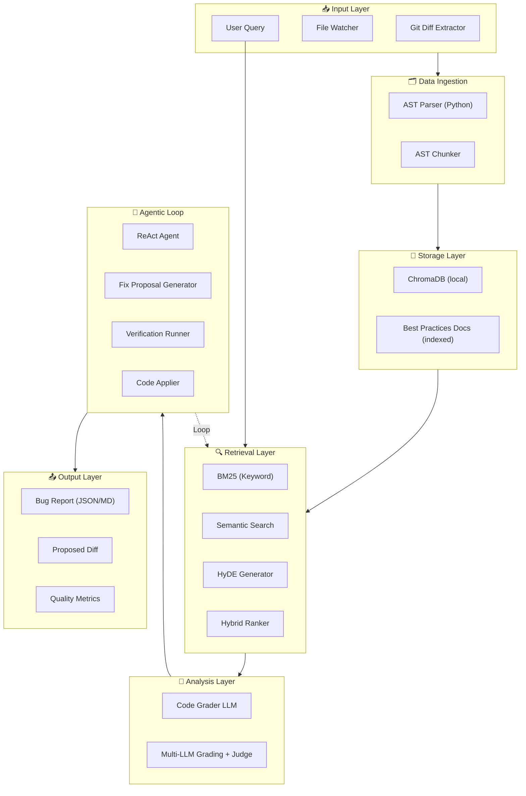
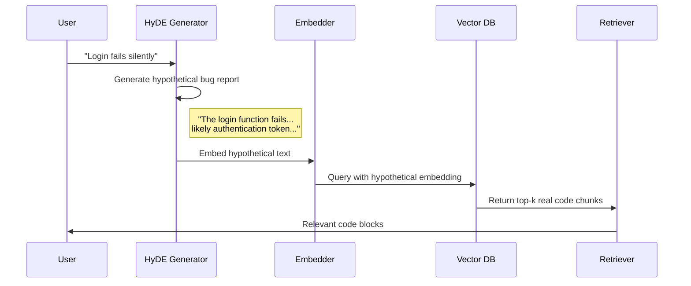
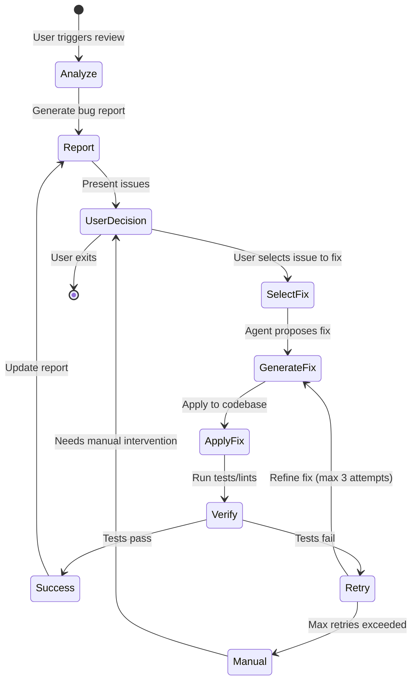

# CodeReview AI - Cursor-like Bug Report Tool (Updated 2026-01-19)

A professional-grade bug reporting and auto-fix system using RAG, multi-LLM evaluation, and agentic loops.

> [!IMPORTANT]
> **Project Adaptation**: This is an alternative implementation of the Applied LLM final project. Instead of the Multi-LLM Collaborative Debate System, we're building a **Cursor-like Code Review Tool** that still demonstrates:
> - Multi-LLM evaluation (grading with different models)
> - Structured critique and refinement (bug detection → fix proposals → verification)
> - Quantitative evaluation metrics
> - Production-ready system architecture

---

## 1. System Architecture (Current Implementation)



---

## 2. Component Specifications

### 2.1 Data Ingestion Layer (Current)

| Component | Technology | Purpose |
|-----------|------------|---------|
| **Git Integration** | subprocess git | Extract diffs from last commit, staged changes, unstaged changes |
| **AST Parser** | Python `ast` | Parse Python code into AST for intelligent chunking |
| **AST Chunker** | Custom Python | Split by function/class boundaries |

#### Git Diff Extraction Logic
```python
# Pseudocode for diff extraction
class GitAnalyzer:
    def get_changes(repo_path: str) -> dict:
        return {
            "staged": get_staged_diff(),      # Changes ready to commit
            "unstaged": get_unstaged_diff(),   # Working directory changes
            "last_commit": get_last_commit_diff(),  # Previous commit diff
            "files_changed": list_modified_files()
        }
```

---

### 2.2 Storage Layer (Current)

| Component | Technology | Specification |
|-----------|------------|---------------|
| **Vector DB** | ChromaDB (local) | Persistent collection with metadata filtering |
| **Embeddings** | `sentence-transformers` (DefaultEmbeddingFunction) | Local embedding model |
| **Document Store** | Markdown files | Best practices, style guides, known patterns |

#### Schema Design
```json
{
  "collection": "codebase",
  "document": {
    "id": "file_path:function_name",
    "content": "full function code",
    "metadata": {
      "file_path": "/src/utils.py",
      "function_name": "calculate_total",
      "language": "python",
      "summary": "Calculates total with tax and discount",
      "imports": ["math", "decimal"],
      "complexity": 5,
      "last_modified": "2025-01-15"
    }
  }
}
```

---

### 2.3 Retrieval Layer (Hybrid RAG, Implemented)

| Strategy | Use Case | Implementation |
|----------|----------|----------------|
| **BM25** | Exact error messages, variable names | `rank_bm25` library |
| **Semantic** | Logic bugs, conceptual issues | Cosine similarity on embeddings |
| **HyDE** | Ambiguous bug descriptions | Generate hypothetical fix, then search |
| **Hybrid** | Default mode | Reciprocal Rank Fusion (RRF) |

#### HyDE Implementation Flow


---

### 2.4 Analysis & Grading Layer (Current)

#### Multi-LLM Grading System (Mirrors Original Assignment)
We use **3 LLM "graders"** that evaluate code independently, then a **judge** picks the best assessment:

| Role | Model (via OpenRouter) | Task |
|------|------------------------|------|
| **Grader 1** | `MODEL_GRADER_SECURITY` | Analyze for security issues |
| **Grader 2** | `MODEL_GRADER_LOGIC` | Analyze for logic bugs |
| **Grader 3** | `MODEL_GRADER_PERF` | Analyze for performance issues |
| **Judge** | `MODEL_JUDGE` | Combine assessments, rank severity |

#### Grading Output Schema
```json
{
  "grader_id": "gpt4_security",
  "issues": [
    {
      "severity": "critical",
      "type": "security",
      "location": {"file": "auth.py", "line": 45, "function": "verify_token"},
      "description": "JWT secret is hardcoded",
      "evidence": "SECRET = 'my-secret-key'",
      "suggested_fix": "Use environment variable: os.getenv('JWT_SECRET')",
      "confidence": 0.95
    }
  ],
  "best_practices_violations": [
    {
      "rule": "PEP8-E501",
      "description": "Line too long (> 120 characters)",
      "count": 3
    }
  ],
  "overall_score": 6.5,
  "summary": "Critical security issue found. Code structure is good but needs secrets management."
}
```

---

### 2.5 Agentic Fix Loop



#### ReAct Agent Actions
| Action | Description | Trigger |
|--------|-------------|---------|
| `SEARCH_CODE` | Query vector DB for relevant code | When context is insufficient |
| `READ_FILE` | Read full file content | When chunk is too small |
| `READ_DOCS` | Consult best practices docs | When unclear about standards |
| `GENERATE_FIX` | Propose code change | When issue is understood |
| `APPLY_FIX` | Write changes to file | When user approves |
| `RUN_TESTS` | Execute test suite | After applying fix |
| `ROLLBACK` | Revert changes | When tests fail |

---

## 3. Implementation Phases (Status)

### Phase 1: Core Infrastructure (Complete)

#### 3.1.1 Project Setup
```
FinalProject/
├── codereview/                 # Main package
│   ├── __init__.py
│   ├── config.py              # Environment & settings
│   ├── git_analyzer.py        # Git diff extraction
│   ├── chunker.py             # AST-based code splitting
│   ├── indexer.py             # Vector DB operations
│   └── models.py              # Pydantic schemas
├── docs/                       # Best practices documents
│   ├── python_style.md
│   ├── security_checklist.md
│   └── common_bugs.md
├── tests/
│   ├── test_git_analyzer.py
│   ├── test_chunker.py
│   └── fixtures/
├── main.py                     # CLI entry point
├── requirements.txt
└── README.md
```

#### 3.1.2 Files to Create

##### [NEW] [config.py](file:///home/coder/uni/applied_LLM/FinalProject/codereview/config.py)
- Environment variables loading (API keys)
- ChromaDB configuration
- Model selection settings

##### [NEW] [git_analyzer.py](file:///home/coder/uni/applied_LLM/FinalProject/codereview/git_analyzer.py)
- `GitAnalyzer` class with methods:
  - `get_staged_diff()` - Get staged changes
  - `get_unstaged_diff()` - Get working directory changes
  - `get_last_commit_diff()` - Get diff from HEAD~1
  - `get_changed_files()` - List all modified files

##### [NEW] [chunker.py](file:///home/coder/uni/applied_LLM/FinalProject/codereview/chunker.py)
- `ASTChunker` class supporting:
  - Python (via `ast` module)
  - JavaScript/TypeScript (via `tree-sitter-javascript`)
- Chunk by function/class boundaries
- Preserve imports and context

---

### Phase 2: RAG Pipeline (Complete)

##### [NEW] [indexer.py](file:///home/coder/uni/applied_LLM/FinalProject/codereview/indexer.py)
- `CodebaseIndexer` class:
  - `index_directory(path)` - Index entire codebase
  - `index_diff(diff)` - Index only changed code
  - `summarize_functions()` - Meta-RAG summaries

##### [NEW] [retriever.py](file:///home/coder/uni/applied_LLM/FinalProject/codereview/retriever.py)
- `HybridRetriever` class:
  - `bm25_search(query)` - Keyword search
  - `semantic_search(query)` - Embedding similarity
  - `hyde_search(query)` - Hypothetical doc embeddings
  - `hybrid_search(query)` - Combined with RRF

---

### Phase 3: Analysis & Grading (Complete)

##### [NEW] [grader.py](file:///home/coder/uni/applied_LLM/FinalProject/codereview/grader.py)
- `MultiLLMGrader` class:
  - `grade_security(code)` - GPT-4 for security
  - `grade_logic(code)` - Claude for logic
  - `grade_performance(code)` - Gemini for perf
  - `judge_and_combine()` - Final verdict

##### [NEW] [report_generator.py](file:///home/coder/uni/applied_LLM/FinalProject/codereview/report_generator.py)
- Generate structured bug reports (JSON + Markdown)
- Severity ranking
- Grouped by category

---

### Phase 4: Agentic Fix Loop (Partial)

##### [NEW] [agent.py](file:///home/coder/uni/applied_LLM/FinalProject/codereview/agent.py)
- `ReActAgent` class:
  - Action selection based on current state
  - Tool calling for `SEARCH_CODE`, `READ_FILE`, etc.
  - Trajectory logging for evaluation

##### [NEW] [fixer.py](file:///home/coder/uni/applied_LLM/FinalProject/codereview/fixer.py)
- `CodeFixer` class:
  - `generate_fix(issue)` - Propose code change
  - `apply_fix(fix)` - Write to file
  - `run_verification()` - Execute tests
  - `rollback()` - Revert on failure

---

### Phase 5: Evaluation (Partial)

##### [NEW] [evaluation/](file:///home/coder/uni/applied_LLM/FinalProject/evaluation/)
- Create evaluation dataset:
  - 25 code samples with known bugs
  - Ground truth labels for issues
- Metrics:
  - Precision/Recall on bug detection
  - Fix success rate
  - False positive rate
- Comparison:
  - Single LLM baseline
  - Multi-LLM grading
  - With/without RAG

---

## 4. Evaluation Strategy

### 4.1 Metrics (Aligned with Original Assignment)

| Metric | Formula | Target |
|--------|---------|--------|
| **Detection Precision** | TP / (TP + FP) | ≥ 0.80 |
| **Detection Recall** | TP / (TP + FN) | ≥ 0.75 |
| **Fix Success Rate** | Successful fixes / Total attempts | ≥ 0.60 |
| **Multi-LLM Improvement** | (Multi - Single) / Single | > 0.15 |

### 4.2 Evaluation Dataset

Create 25 code samples spanning:
| Category | Count | Examples |
|----------|-------|----------|
| Security bugs | 5 | SQL injection, hardcoded secrets, XSS |
| Logic errors | 5 | Off-by-one, null reference, race conditions |
| Performance issues | 5 | N+1 queries, memory leaks, blocking calls |
| Style violations | 5 | PEP8, naming, documentation |
| Clean code | 5 | No bugs (for false positive testing) |

### 4.3 Required Visualizations

```python
# Plots to generate (using matplotlib/seaborn)
plots = [
    "precision_recall_curve.png",      # Detection accuracy
    "fix_success_by_category.png",     # Bar chart by bug type
    "llm_comparison_heatmap.png",      # Model performance matrix
    "rag_vs_baseline.png",             # With/without RAG
    "confidence_calibration.png"       # Predicted vs actual accuracy
]
```

---

## 5. Tech Stack (Actual)

| Layer | Technology | Rationale |
|-------|------------|-----------|
| **Backend** | Python 3.13+ | Mature LLM ecosystem |
| **Vector DB** | ChromaDB | Simple local setup, persistent |
| **Embeddings** | sentence-transformers | Local embedding model |
| **LLMs** | OpenRouter models (configurable) | Multi-model grading |
| **CLI** | `typer` or `click` | User-friendly interface |
| **Testing** | `pytest` | Standard Python testing |
| **Visualization** | `matplotlib` + `seaborn` | Required plots |

---

## 6. API Keys Required (Current)

```env
# .env file
GEMINI_API_KEY=...             # Gemini API key for graders/judge
OPENAI_API_KEY=...             # OpenAI API key for embeddings
GEMINI_API_KEY=...             # Optional: direct Gemini fallback when OpenRouter is unset
```

> [!NOTE]
> As per assignment, you can use **one free model** (e.g., Gemini Flash) for all 3 graders with different system prompts. This is acceptable but may reduce grading diversity.

---

## 7. Verification Plan

### 7.1 Unit Tests

```bash
# Run all unit tests
cd /home/coder/uni/applied_LLM/FinalProject
pytest tests/ -v

# Specific test modules
pytest tests/test_git_analyzer.py -v
pytest tests/test_chunker.py -v
pytest tests/test_indexer.py -v
```

### 7.2 Integration Tests

```bash
# Test full pipeline on sample repo
python main.py analyze --repo ./sample_project --output report.json

# Verify report structure
python -c "import json; r = json.load(open('report.json')); assert 'issues' in r"
```

### 7.3 Manual Testing

1. **Git Diff**: Create a test commit with intentional bugs:
   ```bash
   git add buggy_file.py
   python main.py diff --staged
   # Verify: Report should list the bugs in buggy_file.py
   ```

2. **Fix Loop**: Trigger auto-fix on a known bug:
   ```bash
   python main.py fix --issue 1
   # Verify: Code is modified, tests are run, rollback works if tests fail
   ```

3. **Multi-LLM Grading**: Compare outputs:
   ```bash
   python main.py grade --model gpt4 > gpt4.json
   python main.py grade --model claude > claude.json
   python main.py grade --model gemini > gemini.json
   # Verify: Each finds different issue types
   ```

---

## 8. Timeline Summary

| Phase | Days | Deliverables |
|-------|------|--------------|
| **Infrastructure** | 1-3 | Git analyzer, AST chunker, project scaffold |
| **RAG Pipeline** | 4-7 | Indexer, retriever, HyDE implementation |
| **Analysis** | 8-12 | Multi-LLM graders, report generator |
| **Agentic Loop** | 13-17 | ReAct agent, fixer, verification |
| **Evaluation** | 18-21 | Dataset, metrics, visualizations |
| **Polish** | 22-23 | README, presentation, final testing |

**Due Date**: January 23, 2025 23:59 (original plan date; now past)

---

## 9. User Confirmed Scope (Current)

> [!NOTE]
> **Update Recap**:
> 1. **Project Path**: Confirmed as Alternative Bug Report Tool.
> 2. **Models**: OpenRouter models (configurable in `codereview/config.py`).
> 3. **Scope**: **Agentic Loop** (Analysis -> Report -> Proposed Fix -> Verification).
