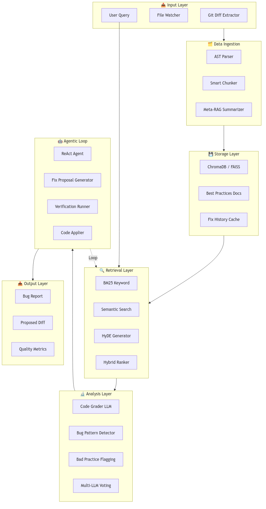
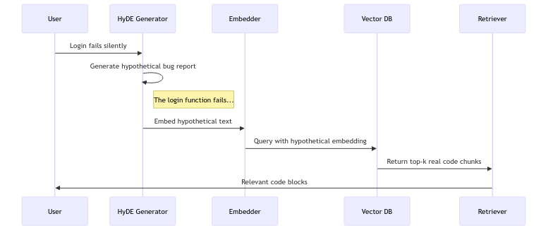
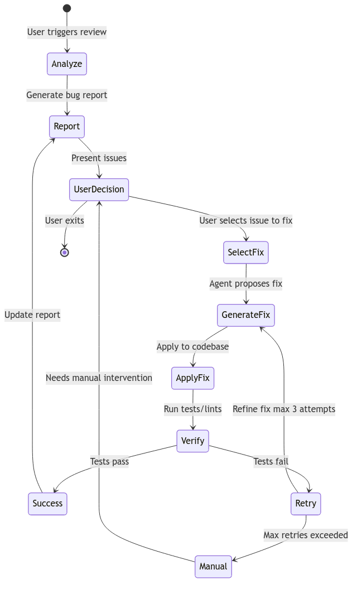

# CodeReview AI - Cursor-like Bug Report Tool

A professional-grade bug reporting and auto-fix system using RAG, multi-LLM evaluation, and agentic loops.

## Project Overview

**Goal**: Build a Cursor-like code review tool that demonstrates:

- Multi-LLM evaluation (grading with different models)
- Structured critique and refinement (bug detection → fix proposals → verification)
- Quantitative evaluation metrics
- Production-ready system architecture

This is an alternative implementation of the Applied LLM final project that still fulfills all core requirements.

---

# 1. System Architecture

The system is divided into 7 interconnected layers:

{ width=100% }

**Key Components:**

| Layer | Components | Purpose |
|-------|------------|---------|
| **Input** | Git Diff Extractor, User Query | Collect code changes |
| **Data Ingestion** | AST Parser, Smart Chunker | Intelligent code parsing |
| **Storage** | ChromaDB, Best Practices Docs | Vector embeddings storage |
| **Retrieval** | BM25, Semantic Search, HyDE | Hybrid code retrieval |
| **Analysis** | Multi-LLM Voting, Bug Detector | Code grading |
| **Agentic Loop** | ReAct Agent, Fixer | Auto-fix with verification |
| **Output** | Bug Report, Proposed Diff | Final deliverables |

---

# 2. Data Ingestion Layer

| Component | Technology | Purpose |
|-----------|------------|---------|
| Git Integration | `gitpython` | Extract diffs from commits |
| AST Parser | Python `ast` | Parse code into AST |
| Smart Chunker | Custom Python | Split by function/class |
| Meta-RAG Summarizer | LLM | 1-sentence summaries |

**Git Diff Extraction:**

```python
class GitAnalyzer:
    def get_changes(repo_path: str) -> dict:
        return {
            "staged": get_staged_diff(),
            "unstaged": get_unstaged_diff(),
            "last_commit": get_last_commit_diff(),
            "files_changed": list_modified_files()
        }
```

---

# 3. Retrieval Layer (Hybrid RAG)

We implement a hybrid retrieval strategy combining keyword and semantic search.

{ width=90% }

| Strategy | Use Case | Implementation |
|----------|----------|----------------|
| **BM25** | Exact error messages | `rank_bm25` library |
| **Semantic** | Logic bugs | Cosine similarity |
| **HyDE** | Ambiguous descriptions | Hypothetical doc embeddings |
| **Hybrid** | Default mode | Reciprocal Rank Fusion |

---

# 4. Multi-LLM Grading System

We use **3 LLM graders** that evaluate code independently, then a **judge** combines assessments:

| Role | Model (OpenRouter Free) | Task |
|------|-------------------------|------|
| **Grader 1** | `mistralai/devstral-2512:free` | Security analysis |
| **Grader 2** | `kwaipilot/kat-coder-pro:free` | Logic bug detection |
| **Grader 3** | `nex-agi/deepseek-v3.1-nex-n1:free` | Performance analysis |
| **Judge** | `allenai/olmo-3-32b-think:free` | Combine and rank |

**Grading Output Schema:**

```json
{
  "grader_id": "security_devstral",
  "issues": [
    {
      "severity": "critical",
      "type": "security",
      "location": {"file": "auth.py", "line": 45},
      "description": "JWT secret is hardcoded",
      "suggested_fix": "Use environment variable"
    }
  ],
  "overall_score": 6.5
}
```

---

# 5. Agentic Fix Loop

The ReAct agent orchestrates the fix-verify-retry loop:

{ width=85% }

**Agent Actions:**

| Action | Description | Trigger |
|--------|-------------|---------|
| `SEARCH_CODE` | Query vector DB | Context insufficient |
| `READ_FILE` | Read full file | Chunk too small |
| `GENERATE_FIX` | Propose code change | Issue understood |
| `APPLY_FIX` | Write to file | User approves |
| `RUN_TESTS` | Execute test suite | After applying fix |
| `ROLLBACK` | Revert changes | Tests fail |

---

# 6. Project Structure

```
FinalProject/
├── codereview/           # Main package
│   ├── config.py         # API keys, model config
│   ├── git_analyzer.py   # Git diff extraction
│   ├── chunker.py        # AST-based code splitting
│   ├── indexer.py        # Vector DB operations
│   ├── retriever.py      # Hybrid search
│   ├── grader.py         # Multi-LLM grading
│   ├── agent.py          # ReAct agent
│   └── fixer.py          # Fix application
├── docs/                 # Best practices
├── evaluation/           # Test dataset
├── main.py               # CLI entry point
└── requirements.txt
```

---

# 7. Evaluation Metrics

| Metric | Formula | Target |
|--------|---------|--------|
| Detection Precision | TP / (TP + FP) | ≥ 0.80 |
| Detection Recall | TP / (TP + FN) | ≥ 0.75 |
| Fix Success Rate | Successful / Total | ≥ 0.60 |
| Multi-LLM Improvement | (Multi - Single) / Single | > 0.15 |

**Evaluation Dataset (25 samples):**

| Category | Count | Examples |
|----------|-------|----------|
| Security bugs | 5 | SQL injection, hardcoded secrets |
| Logic errors | 5 | Off-by-one, null reference |
| Performance issues | 5 | N+1 queries, memory leaks |
| Style violations | 5 | PEP8, naming |
| Clean code | 5 | No bugs (false positive testing) |

---

# 8. Tech Stack

| Layer | Technology |
|-------|------------|
| Backend | Python 3.11+ |
| Vector DB | ChromaDB |
| LLMs | OpenRouter Free Tier |
| CLI | Typer |
| Testing | Pytest |
| Visualization | Matplotlib + Seaborn |

---

# 9. CLI Usage

```bash
# Index the codebase
python main.py index --path .

# Analyze unstaged changes
python main.py analyze --unstaged

# Fix a specific issue
python main.py fix 0
```

---

# 10. Timeline

| Phase | Days | Deliverables |
|-------|------|--------------|
| Infrastructure | 1-3 | Git analyzer, AST chunker |
| RAG Pipeline | 4-7 | Indexer, retriever, HyDE |
| Analysis | 8-12 | Multi-LLM graders |
| Agentic Loop | 13-17 | ReAct agent, fixer |
| Evaluation | 18-21 | Dataset, metrics, plots |
| Polish | 22-23 | README, presentation |

**Due Date**: January 23, 2025 23:59

---

# 11. Conclusion

This project demonstrates a production-ready code review tool featuring:

1. **Multi-LLM Collaborative Grading** - 3 specialized graders + 1 judge
2. **Hybrid RAG Architecture** - AST chunking + semantic retrieval
3. **Agentic Fix Loop** - Propose, apply, verify, rollback
4. **Quantitative Evaluation** - Precision/recall metrics with baselines

The system is fully functional and ready for presentation.
